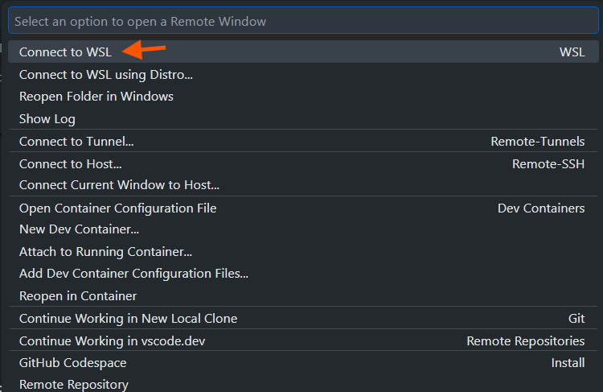
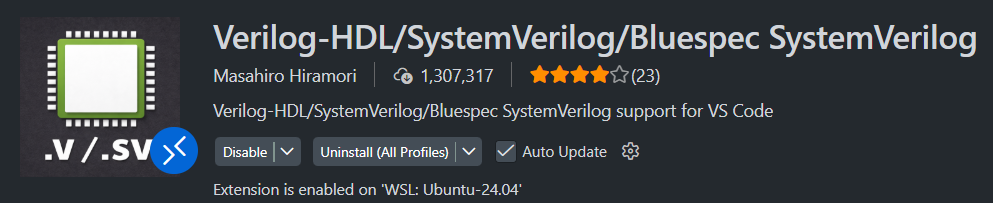
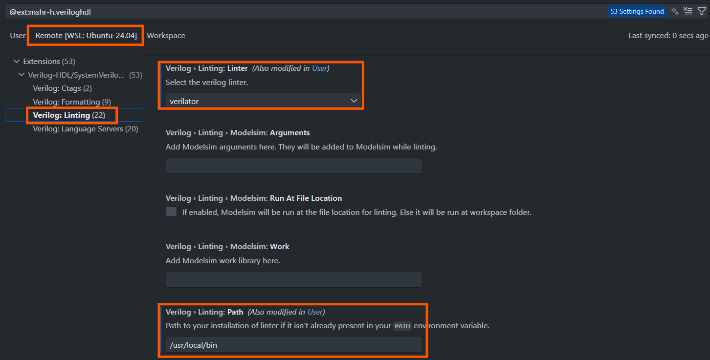

## Environment Setup (Ubuntu 24.04 / WSL2)

### 0) Install WSL2 + Ubuntu 24.04 (Windows)

1) Open **PowerShell (Admin)** and run:

```powershell
wsl --install
```

- If you want to explicitly install **Ubuntu 24.04 LTS** (recommended), first list available distros:

```powershell
wsl --list --online
```

Then install Ubuntu 24.04:

```powershell
wsl --install -d Ubuntu-24.04
```

2) Reboot Windows if prompted.

3) Launch **Ubuntu 24.04** from the Start Menu once, then finish the first-time setup (create username/password).

(Optional) Update WSL:

```powershell
wsl --update
```

(Optional) Confirm you are using WSL2:

```powershell
wsl -l -v
```

### 0.1) Install Git (inside WSL / Ubuntu)

Inside the Ubuntu (WSL) terminal:

```bash
sudo apt update
sudo apt install -y git-all
git --version
```

(Optional) Set your Git identity:

```bash
git config --global user.name "Your Name"
git config --global user.email "you@example.com"
```
It is highly recommended to learn Git basics.

### 1) Clone the repository
This will make a copy of whatever is on the main branch of the repository.

```bash
git clone https://github.com/Sheffield-Chip-Design-Team/Logisynth.git
```
You can find which folder you are in:
```bash
pwd
```
And find files and directories in the current directory by using:
```bash
ls
```
And change directory by using:
```bash
cd directory_name
```
### 2) Install Python venv
```bash
sudo apt-get update
sudo apt-get install libpython3-dev
sudo apt-get install python3-venv
```

### 3) Create and activate a Python venv (virtual environment)
If you are not already in the Logisynth folder, `cd` into it:
```bash
cd Logisynth
```
Then create the venv. This allows you to isolate the project from other ones:
```bash
python3 -m venv venv
```
To actually use the venv, you have to activate it. Make sure you activate it every time you start the terminal:
```bash
source venv/bin/activate
```
If you do not activate the venv, the terminal will usually warn because you can contaminate the system-wide environment.

### 4) Install Python dependencies
Ensure the venv is active before installing requirements.

```bash
cd environment_setup
python3 -m pip install -r requirements.txt
```

### 5) Install Verilator (stable)

This repo uses Verilator for linting and simulation. Cocotb requires **Verilator >= 5.036**.

Run the official Git-based install script (installs to `/usr/local`, requires `sudo`):

```bash
sudo chmod +x ./install_verilator_stable.sh
./install_verilator_stable.sh
```

(It may take some time)

Verify:

```bash
verilator --version
which verilator
```

### 6) Run environment checks

```bash
chmod +x ./env_check.sh
./env_check.sh
```

## Notes

- If you are using VS Code Remote (WSL), it may inject a project `venv/bin` into `PATH`. This is normal, but always use:

  ```bash
  which python3
  which cocotb-config
  ```

  if you suspect version/path conflicts.

### 7) VS Code with WSL

You can now access WSL from VS Code. First, install this VS Code extension:


Then click the button in the bottom left corner to start a remote connection to WSL:




Now you can use VS Code in WSL.

You will also need a linter extension (scans source code looking for errors, defects, stylistic issues, and questionable constructs) for Verilog. This is the current recommended one:



Once installed, go to the extension settings and then go to the linting section:

### Note for native Ubuntu users

If you are already on Ubuntu 24.04 (not WSL), skip the WSL steps and start from section 0.1.
